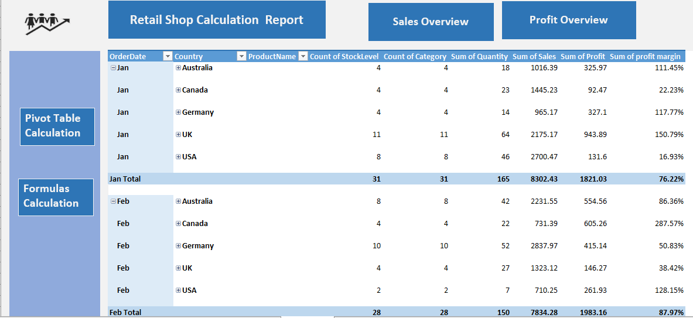
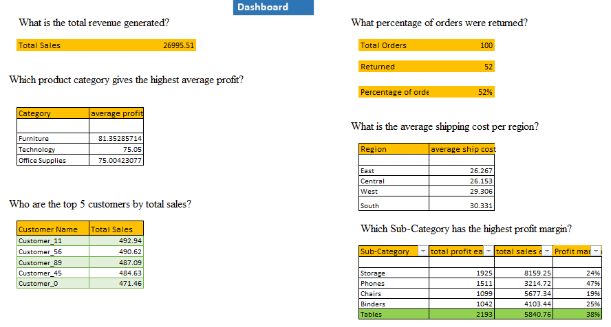

# Retail Shop - Business Sales Analysis 🧾

## Summary Report
A comprehensive breakdown of a real-world dataset, analyzed and visualized to uncover actionable insights.

### GitHub Project Objective

“This project analyzes sales, profit, and profit margin data to uncover trends and actionable insights that support better business decisions. Using Excel formulas, PivotTables, and dashboards, the project transforms raw data into clear, visual reports that help optimize profitability and guide strategic planning.”

### Highlights:
- 💰 **Total Revenue**: $26,995.51M
- 🪑 **Top Product Category**: Furniture (81.35% of Sales)
- 🏆 **Top 5 Customers**: Responsible for 20.31% of all sales
- 🔁 **Return Rate**: 52% of Total Orders (focus for process improvement!)
- 📊 **Monthly Sales Trends**: Line Chart Visualization
- 🚚 **Average Shipping Cost/Region**: $28.95
- 💡 **Top Sub-Category by Profit Margin**: Phones (47%)

---

## 🔧 Tools Used:
- **SQL** for data extraction
- **Excel** for cleaning and analysis

---

## 💻 Techniques Applied:
- **Advanced Excel Formulas**: `SUM`, `AVERAGEIFS`, `IF`, `VLOOKUP`
- **PivotTables & Dashboards**
- **SQL Aggregations**: `SUM`, `AVG`
- **SQL Filtering and Sorting**: `GROUP BY`, `ORDER BY`, `LIMIT`
** 

** 

---

## Detailed Analysis:

### Total Revenue:
- **Total Revenue Analyzed**: $26,995.51M

### Top-Selling Categories:
- **Highest Selling Product Category**: Furniture (81.35% Contribution)

### Customer Insights:
- **Top 5 Customers**: Contribute to **20.31%** of total sales.  
  Maintaining relationships with these customers is crucial for sustained growth.

### Returns and Shipping:
- **Return Rate**: 52% of total orders were returned.  
  Focus on evaluating product descriptions or revising return policies to minimize losses.

- **Average Shipping Cost per Region**: $28.95  
  Potential to optimize shipping costs by analyzing regional delivery differences.

### Product Profitability:
- **Top Sub-Category by Profit Margin**: Phones (47%)  
  Promoting or expanding phone-related products will increase profitability.

### Sales Trends:
- **Monthly Sales Trends**: Visualized through line charts to identify seasonality and performance over time.

---

## Key Insights & Recommendations:
1. **High Return Rate**:  
   Evaluate the quality of products in high-return categories or revise return policies to minimize losses.
   
2. **Focus on High-Margin Products**:  
   Promote high-margin products like phones to increase profitability.
   
3. **Customer Relationship Management**:  
   Focus on nurturing relationships with top customers to ensure continued loyalty and repeat business.

